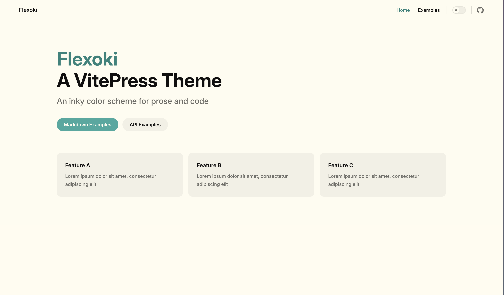
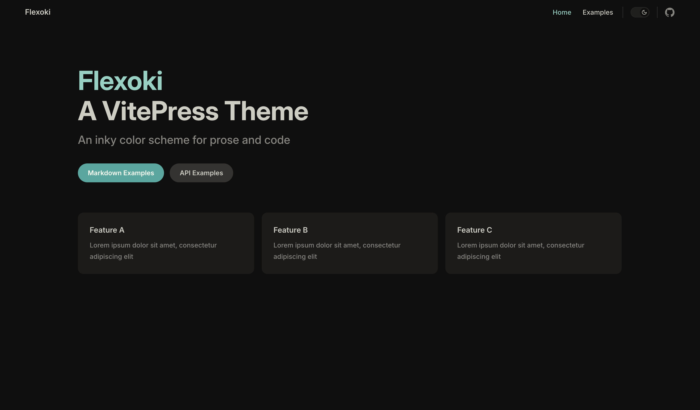

# [Flexoki](https://stephango.com/flexoki) for [VitePress](https://github.com/vuejs/vitepress)

[![npm version][npm-version-src]][npm-version-href]
[![npm downloads][npm-downloads-src]][npm-downloads-href]
[![License][license-src]][license-href]

A [Flexoki](https://stephango.com/flexoki)-inspired theme for [VitePress](https://github.com/vuejs/vitepress).

> Requires VitePress 1.x.

## Usage

1. Install the theme:

```sh
pnpm add -D vitepress-theme-flexoki
# or: npm i -D vitepress-theme-flexoki
```

2. Import it in your theme config:

```ts
// .vitepress/theme/index.ts
import DefaultTheme from 'vitepress/theme'
import 'vitepress-theme-flexoki/index.css'

export default DefaultTheme
```

<details>
<summary>Manual install</summary>

Copy [index.css](./index.css) into your theme folder and import it.

</details>

## Previews





## Credits

- [Flexoki](https://stephango.com/flexoki) palette by [Steph Ango](https://stephango.com)

## License

[MIT](https://github.com/mancuoj/vitepress-theme-flexoki/blob/main/LICENSE) License © 2025-PRESENT [Mancuoj](https://github.com/mancuoj)

<!-- Badges -->

[npm-version-src]: https://img.shields.io/npm/v/vitepress-theme-flexoki?style=flat&colorA=18181b&colorB=1f6feb
[npm-version-href]: https://npmjs.com/package/vitepress-theme-flexoki
[npm-downloads-src]: https://img.shields.io/npm/dm/vitepress-theme-flexoki?style=flat&colorA=18181b&colorB=1f6feb
[npm-downloads-href]: https://npmjs.com/package/vitepress-theme-flexoki
[license-src]: https://img.shields.io/github/license/mancuoj/vitepress-theme-flexoki.svg?style=flat&colorA=18181b&colorB=1f6feb
[license-href]: https://github.com/mancuoj/vitepress-theme-flexoki/blob/main/LICENSE
